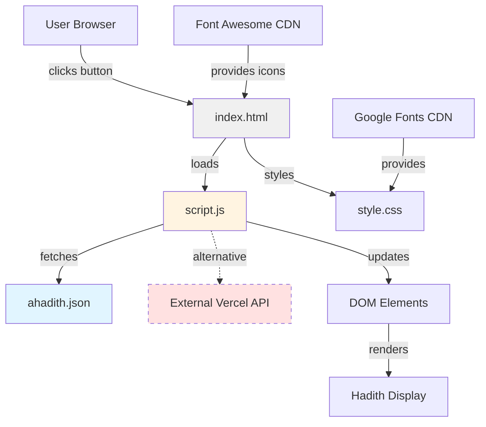
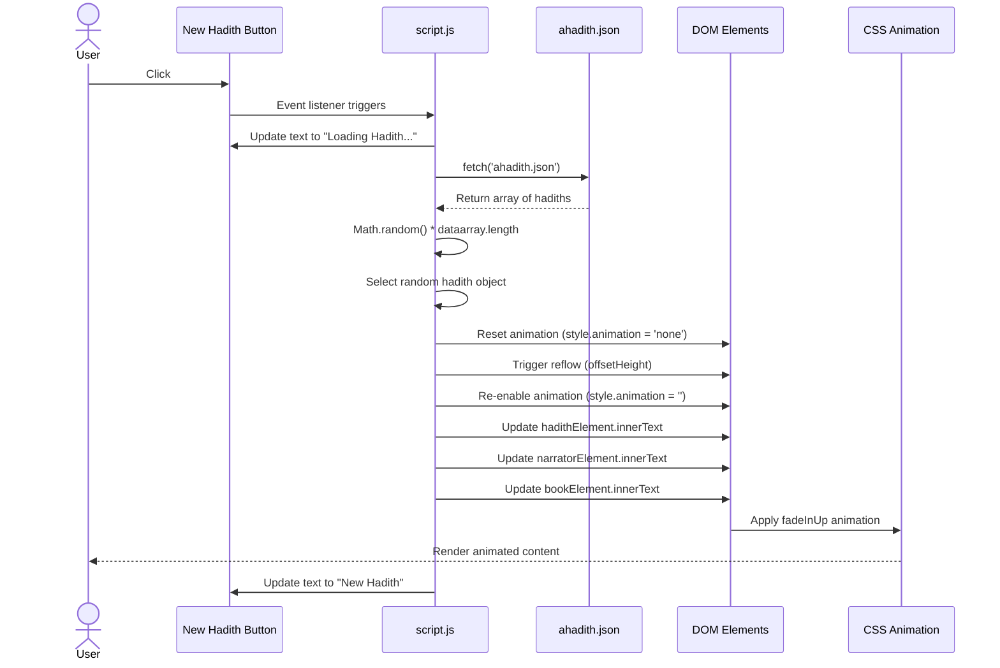

# Hadith of the Day - Architecture Documentation

## Table of Contents

1. [Overview](#overview)
2. [Repo Use Cases](#repo-use-cases)
3. [High-Level Architecture](#high-level-architecture)
4. [Core Components](#core-components)
5. [Data Flow](#data-flow)
6. [Code Implementation](#code-implementation)
7. [Integration Points](#integration-points)
8. [Configuration](#configuration)
9. [Monitoring and Operations](#monitoring-and-operations)

---

## Overview

The Hadith of the Day is a client-side web application that displays random Islamic hadiths (sayings and actions of Prophet Muhammad ﷺ) to users. The system is a single-page application built with vanilla JavaScript, HTML, and CSS, with no backend server component.

**Position in Repository**: This is a standalone front-end application with all core functionality contained within three primary files: `index.html`, `script.js`, and `style.css`.

**Key Characteristics**:

1. **Client-side architecture** - All logic executes in the browser with no server-side processing
2. **Dual data source strategy** - Supports both local JSON data and external API integration
3. **Minimal dependencies** - Uses only standard web APIs and external font libraries
4. **Responsive design** - Adapts to various screen sizes with mobile-first considerations
5. **Animated user experience** - Implements CSS animations for content transitions

---

## Repo Use Cases

### Use Case 1: Display Random Hadith from Local Data

**Trigger**: User clicks the "New Hadith" button on the web interface

**Components Involved**:
- Button click event listener in `script.js:49`
- `findrandomhadith()` function in `script.js:19-31`
- Local `ahadith.json` data file
- `displayHadith()` rendering function in `script.js:33-47`

**Outcome**: The application fetches a random hadith from the local JSON file containing 49 hadiths, displays the English text, narrator information, and source book reference with a fade-in animation.

**Important Constraints**: The local JSON file must be accessible via HTTP fetch (requires web server or file:// protocol support). The random selection uses `Math.random()` which may repeat hadiths.

### Use Case 2: Display Random Hadith from External API

**Trigger**: User clicks the "New Hadith" button (alternative implementation available but not currently active)

**Components Involved**:
- `fetchRandomHadith()` function in `script.js:6-17`
- External Vercel API endpoint
- `displayHadith()` rendering function

**Outcome**: The application requests a random hadith from the Bukhari collection via the external API, parses the JSON response, and displays the content with narrator and book information.

**Important Constraints**: Requires active internet connection. API endpoint must be available and return data in the expected format. This function is defined but not currently wired to the button click event.

### Use Case 3: Animate Content Display

**Trigger**: Any hadith display operation (called from both `findrandomhadith()` and `fetchRandomHadith()`)

**Components Involved**:
- `displayHadith()` function animation reset logic in `script.js:35-37`
- CSS `@keyframes fadeInUp` animation in `style.css:242-251`
- Hadith display elements (`#hadis`, `#narrator`, `#book`)

**Outcome**: When new content is loaded, the previous animation is reset, and a new fade-in-up animation plays, transitioning the hadith text from 80px below its position with 0 opacity to its final position with full opacity over 1 second.

**Important Constraints**: Animation requires browser support for CSS animations and JavaScript DOM manipulation.

---

## High-Level Architecture



**Architectural Decisions**:

1. **Static client-side architecture**: The application is entirely front-end focused with no backend server, enabling simple hosting on any static file server or CDN.

2. **Dual data source pattern**: The codebase contains two data fetching functions (`fetchRandomHadith()` and `findrandomhadith()`), suggesting an evolution from external API dependency to local data storage. Currently, the local data source is active (script.js:49).

3. **Separation of concerns**: HTML provides structure, CSS handles presentation including animations and responsive design, and JavaScript manages data fetching and DOM manipulation.

4. **Stateless operation**: No data persistence mechanism is evident. Each page load or refresh resets the application state.

---

## Core Components

### 1. HTML Interface (`index.html`)

**File**: `index.html`

**Purpose**: Defines the structural layout and DOM elements for the application.

**Key Responsibilities**:
- Establishes the page structure with semantic HTML
- Loads external dependencies (Google Fonts, Font Awesome, local CSS/JS)
- Provides target elements for dynamic content injection
- Displays the TUD Islamic Society branding

**Primary Elements**:
- `.container` (line 22): Main application wrapper
- `header` (line 23): "Hadith of the day" title
- `.logo` image (line 24): Branding element positioned absolutely
- `#narrator` and `#book` spans (lines 26-27): Metadata display
- `#hadis` paragraph (line 31): Primary hadith text display
- `#newb` button (line 35): Triggers hadith fetching

### 2. JavaScript Controller (`script.js`)

**File**: `script.js`

**Purpose**: Implements all application logic including data fetching, random selection, and DOM manipulation.

**Key Responsibilities**:
- Fetch hadith data from local JSON file
- Select random hadiths from the dataset
- Update DOM elements with fetched content
- Manage loading states and error handling
- Control animation lifecycle

**Primary Functions**:
- `fetchRandomHadith()`: External API integration (inactive)
- `findrandomhadith()`: Local JSON data fetching (active)
- `displayHadith()`: Content rendering and animation

**DOM References** (lines 1-4):
- `hadithElement`: Reference to `#hadis` paragraph
- `newHadithButton`: Reference to `#newb` button
- `narratorElement`: Reference to `#narrator` span
- `bookElement`: Reference to `#book` span

### 3. Stylesheet (`style.css`)

**File**: `style.css`

**Purpose**: Provides visual styling, layout, animations, and responsive behaviour.

**Key Responsibilities**:
- Define colour scheme (teal #035d6f, orange #e27c39, grey #6a7b7f)
- Implement responsive grid layout with flexbox
- Create fade-in-up animation for content transitions
- Style interactive elements with hover states
- Position branding elements absolutely
- Provide mobile-responsive breakpoints

**Key Style Sections**:
- Body and container layout (lines 2-23)
- Typography and header styling (lines 26-50)
- Hadith text display with quotation marks (lines 64-204)
- Button interactions and hover effects (lines 82-135)
- Logo positioning and hover rotation (lines 138-167)
- Responsive media queries (lines 207-217)
- Animation keyframes (lines 242-251)

### 4. Data Store (`ahadith.json`)

**File**: `ahadith.json`

**Purpose**: Provides local storage of 49 hadith records in structured JSON format.

**Data Structure**:
Each hadith object contains:
- `id`: Numeric identifier (note: some duplicates exist, e.g., multiple id:49)
- `header`: Narrator attribution text
- `hadith_english`: Full English translation of the hadith
- `narrator`: Short narrator name
- `book`: Source collection (e.g., "Sahih Al-Bukhari", "Sahih Muslim")
- `chapter`: (optional) Chapter reference
- `topic`: (optional) Subject categorisation
- `url`: External reference link to sunnah.com

**Size**: 591 lines containing 49 hadith entries

---

## Data Flow

### Primary Data Flow: Local Hadith Display



**Input**: User click event on the "New Hadith" button

**Processing Steps**:

1. **Event capture** (script.js:49): Click event listener invokes `findrandomhadith()`
2. **Loading state** (script.js:21): Button text changes to "Loading Hadith..." for user feedback
3. **Data fetch** (script.js:22): Asynchronous HTTP request to `ahadith.json`
4. **Response parsing** (script.js:23): JSON response converted to JavaScript array
5. **Random selection** (script.js:24): Random index calculated using `Math.floor(Math.random() * dataarray.length)`
6. **Data extraction** (script.js:25): Hadith object retrieved from array
7. **Display delegation** (script.js:26): `displayHadith()` called with three parameters
8. **Animation reset** (script.js:35-37): Previous animation cleared and reflow triggered
9. **Content update** (script.js:39-41): DOM elements populated with new content
10. **Animation application** (script.js:44): CSS animation applied via inline style
11. **State restoration** (script.js:46): Button text reset to "New Hadith"

**Output**: Updated DOM displaying random hadith with fade-in animation

**Error Handling Path**:
- If fetch fails (network error, missing file), catch block executes (script.js:27-30)
- Error logged to console: `console.error('Error fetching Hadith:', error)`
- Button text set to "Failed to load Hadith"
- No retry mechanism is implemented

### Alternative Data Flow: External API (Inactive)

The `fetchRandomHadith()` function (script.js:6-17) follows a similar pattern but targets an external endpoint:

1. Fetches from `https://random-hadith-generator.vercel.app/bukhari/`
2. Expects nested response structure: `data.data.hadith_english`, `data.data.header`, `data.data.book`
3. Includes identical error handling and loading state management

This function is defined but not currently connected to any event listener, indicating it may be legacy code or a future enhancement.

---

## Code Implementation

### Entry Point: Button Click Event Listener

**File**: `script.js`

```javascript
newHadithButton.addEventListener('click', findrandomhadith);
```

**Explanation**: This line establishes the primary entry point for user interaction. When the button with ID `newb` is clicked, the `findrandomhadith` function is invoked. This is the only active event listener in the application, making it the sole trigger for application behaviour. The event listener is registered immediately when the script loads.

---

### DOM Element References

**File**: `script.js`

```javascript
const hadithElement = document.getElementById('hadis');
const newHadithButton = document.getElementById('newb');
const narratorElement = document.getElementById('narrator');
const bookElement = document.getElementById('book');
```

**Explanation**: These lines establish references to the four key DOM elements that the application will manipulate. Using `const` ensures these references cannot be reassigned. The elements are retrieved by ID, which is efficient and provides direct access. These references are used throughout the execution flow to update content and manage state.

---

### Local Data Fetching Function

**File**: `script.js`

```javascript
async function findrandomhadith() {
  try {
    newHadithButton.innerText = 'Loading Hadith...';
    const response = await fetch('ahadith.json');
    const dataarray = await response.json();
    const randomIndex = Math.floor(Math.random() * dataarray.length);
    const data = dataarray[randomIndex];
    displayHadith(data.hadith_english, data.header, data.book);
  } catch (error) {
    console.error('Error fetching Hadith:', error);
    newHadithButton.innerText = 'Failed to load Hadith';
  }
}
```

**Explanation**: This async function is the core of the local data flow. It begins by updating the button text to provide immediate user feedback (line 21). The `fetch()` API requests the local JSON file (line 22), which must be served via HTTP or supported by the browser's file protocol. The response is parsed to a JavaScript array (line 23). A random index is calculated using `Math.random()` multiplied by array length and floored to ensure an integer (line 24). The selected hadith object is extracted (line 25) and passed to the display function (line 26). The try-catch structure ensures any fetch or parsing errors are caught, logged, and communicated to the user via button text (lines 27-30).

---

### Random Number Generation

**File**: `script.js`

```javascript
const randomIndex = Math.floor(Math.random() * dataarray.length);
const data = dataarray[randomIndex];
```

**Explanation**: This is the randomisation mechanism. `Math.random()` generates a floating-point number between 0 (inclusive) and 1 (exclusive). Multiplying by `dataarray.length` (49 hadiths) produces a range from 0 to 48.999..., and `Math.floor()` truncates to an integer from 0 to 48. This index directly accesses the array, making the selection O(1) time complexity. There is no mechanism to prevent consecutive repeats, and no tracking of previously displayed hadiths.

---

### Display and Animation Control

**File**: `script.js`

```javascript
function displayHadith(hadith, narrator, book) {
  // Reset animation
  hadithElement.style.animation = 'none';
  hadithElement.offsetHeight; // trigger reflow
  hadithElement.style.animation = '';

  hadithElement.innerText = hadith;
  narratorElement.innerText = narrator;
  bookElement.innerText = book;

  // Apply animation
  hadithElement.style.animation = 'fadeInUp 1s forwards';

  newHadithButton.innerText = 'New Hadith';
}
```

**Explanation**: This function handles content rendering and animation lifecycle. Lines 35-37 implement an animation reset pattern: setting `style.animation` to `'none'` removes any existing animation, accessing `offsetHeight` forces a browser reflow (a critical step that ensures the browser recognises the animation removal before reapplying it), and setting `style.animation` to empty string restores the default CSS animation. Lines 39-41 update the text content of the three display elements using `innerText`, which automatically escapes HTML and prevents XSS vulnerabilities. Line 44 explicitly applies the `fadeInUp` animation inline, which takes precedence over CSS rules. The animation runs for 1 second and maintains its end state (`forwards`). Finally, line 46 resets the button to its default state, completing the interaction cycle.

---

### Animation Reset Mechanism

**File**: `script.js`

```javascript
hadithElement.style.animation = 'none';
hadithElement.offsetHeight; // trigger reflow
hadithElement.style.animation = '';
```

**Explanation**: This three-line sequence is essential for restarting CSS animations. Simply changing the text content does not restart an animation that has already completed. Setting `animation` to `'none'` removes the animation state. The `offsetHeight` access is a deliberate side-effect operation that forces the browser to recalculate layout (reflow), ensuring the animation removal is processed before the next step. Resetting to empty string allows the CSS-defined animation to reapply. Without the reflow trigger, the animation would not restart on subsequent button clicks.

---

### Error Handling Pattern

**File**: `script.js`

```javascript
} catch (error) {
  console.error('Error fetching Hadith:', error);
  newHadithButton.innerText = 'Failed to load Hadith';
}
```

**Explanation**: This catch block handles all errors in the async operation, including network failures, JSON parsing errors, and file access issues. The error is logged to the browser console with a descriptive prefix for debugging purposes. User feedback is provided by changing the button text to indicate failure. However, this implementation has limitations: it does not restore the button to a working state, does not implement retry logic, and does not distinguish between different error types (network vs. parsing vs. file not found).

---

### External API Integration (Inactive Implementation)

**File**: `script.js`

```javascript
async function fetchRandomHadith() {
  try {
    newHadithButton.innerText = 'Loading Hadith...';
    const response = await fetch('https://random-hadith-generator.vercel.app/bukhari/');
    const data = await response.json();
    console.log(data);
    displayHadith(data.data.hadith_english, data.data.header, data.data.book);
  } catch (error) {
    console.error('Error fetching Hadith:', error);
    newHadithButton.innerText = 'Failed to load Hadith';
  }
}
```

**Explanation**: This function demonstrates an alternative data source pattern. It follows the same structure as `findrandomhadith()` but targets an external Vercel API endpoint (line 9). The response structure differs from the local JSON, requiring nested access via `data.data.*` (line 12). Line 11 includes a `console.log()` statement, suggesting this was used for debugging during development. This function is not currently invoked by any event listener, indicating the application has migrated from external API dependency to local data, possibly for performance, reliability, or offline capability reasons.

---

### CSS Animation Definition

**File**: `style.css`

```css
@keyframes fadeInUp {
    from {
        opacity: 0;
        transform: translateY(80px);
    }
    to {
        opacity: 1;
        transform: translateY(0);
    }
}
```

**Explanation**: This keyframe animation creates a smooth entrance effect for hadith text. The `from` state (lines 243-246) positions the element 80 pixels below its final position with full transparency. The `to` state (lines 247-250) brings the element to its natural position with full opacity. When applied with `1s` duration (script.js:44), this creates a one-second transition that draws user attention to new content. The animation uses `transform` rather than `top/bottom` positioning for better performance, as transforms can be GPU-accelerated.

---

### Hadith Display Styling

**File**: `style.css`

```css
.hadis {
    font-family: 'Nunito Sans', sans-serif;
    font-size: 24px;
    margin-bottom: 20px;
    color: #6a7b7f; /* Medium Grey Text */
    text-shadow: 1px 1px 2px rgba(0, 0, 0, 0.1);
    padding: 10px;
    border-left: 4px solid #035d6f; /* Dark Teal Border */
    background: rgba(255, 255, 255, 0.8);
    border-radius: 10px;
    box-shadow: 0 5px 10px rgba(0, 0, 0, 0.1);
    position: relative;
    opacity: 0;
    transform: translateY(20px);
    animation: fadeInUp 1s forwards;
}
```

**Explanation**: This CSS rule defines the visual presentation of the hadith text. Line 66 specifies the Google Font 'Nunito Sans' for readability. Lines 69-70 add subtle depth with text shadow. Line 72 creates a vertical accent with a 4px teal left border. Line 73 uses semi-transparent white background for layering effects. Lines 77-79 set the initial animation state (invisible, offset downward), which matches the `from` state of the `fadeInUp` animation. Line 79 applies the animation by default, though JavaScript overrides this with inline styles for dynamic control.

---

### Decorative Quotation Marks

**File**: `style.css`

```css
.hadis:before {
    content: '"';
    font-size: 40px;
    color: rgba(0, 0, 0, 0.2);
    position: absolute;
    top: -20px;
    left: -20px;
}

.hadis:after {
    content: '"';
    font-size: 40px;
    color: rgba(0, 0, 0, 0.2);
    position: absolute;
    bottom: -20px;
    right: -20px;
}
```

**Explanation**: These pseudo-elements (lines 188-204) add decorative quotation marks around the hadith text using pure CSS. The `::before` pseudo-element positions an opening quote at top-left (lines 188-196), whilst `::after` positions a closing quote at bottom-right (lines 198-204). Both use absolute positioning relative to the `.hadis` container (which has `position: relative`, line 76). The semi-transparent black colour (0.2 opacity) ensures the quotes are visible but subtle, not interfering with text readability. This is a decorative enhancement achieved without modifying HTML structure.

---

### Button Interaction Styling

**File**: `style.css`

```css
.newb {
    color: #eee;
    border: 1px solid #afafaf;
    background-color: #035d6f; /* Dark Teal Button */
    padding: 10px 20px;
    border-radius: 7px;
    cursor: pointer;
    transition: background-color 0.3s ease, border-color 0.3s ease, color 0.3s ease;
}

.newb:hover {
    border-color: #e27c39; /* Orange Border on Hover */
    background-color: #e27c39; /* Bright Orange on Hover */
    color: #fff;
}
```

**Explanation**: Lines 121-129 define the button's default appearance with teal background (#035d6f) and light grey text. Line 128 applies a 0.3-second transition to background colour, border colour, and text colour for smooth hover effects. Lines 131-135 define the hover state, changing to orange (#e27c39) for both background and border, creating visual feedback that the button is interactive. The `cursor: pointer` (line 127) changes the mouse cursor to indicate clickability. This styling complements the JavaScript text changes ("Loading Hadith...", "New Hadith") to provide multi-layered user feedback.

---

### Responsive Design Breakpoint

**File**: `style.css`

```css
@media (max-width: 768px) {
    .container {
        width: 90%;
    }
    .logo {
        width: 40px;
    }
    .buttons button {
        margin: 10px 0;
    }
}
```

**Explanation**: This media query (lines 207-217) adjusts the layout for screens narrower than 768px, typically tablets and mobile phones. Line 209 changes the container from fixed 680px (line 14) to 90% of viewport width, ensuring content fits smaller screens. Line 212 reduces the logo from 160px (line 143) to 40px to prevent it from overwhelming the interface. Line 215 adjusts button margins to vertical spacing (10px top/bottom, 0 left/right), likely preparing for stacked button layouts. This demonstrates mobile-first responsive design principles.

---

## Integration Points

### 1. External Hadith API (Inactive)

**Endpoint**: `https://random-hadith-generator.vercel.app/bukhari/`

**Usage**: The `fetchRandomHadith()` function (script.js:6-17) targets this endpoint to retrieve random hadiths from the Bukhari collection.

**Expected Response Format**:
```json
{
  "data": {
    "hadith_english": "Hadith text in English...",
    "header": "Narrated by...",
    "book": "Source book name"
  }
}
```

**Evidence**: The API call is visible in script.js:9, and the response structure is accessed via `data.data.*` in script.js:12.

**Integration Status**: This integration is defined but not currently active. The function is not connected to any event listener, suggesting it has been replaced by local data storage.

---

### 2. Google Fonts CDN

**Endpoint**: `https://fonts.googleapis.com` and `https://fonts.gstatic.com`

**Usage**: Multiple Google Fonts links in `index.html` (lines 8, 10, 13, 14) load custom typefaces.

**Loaded Fonts**:
- Nunito Sans (used for hadith text, style.css:66)
- Montserrat
- Aboreto
- Alkalami
- Baloo Bhai 2
- Baloo Bhaina 2
- Bree Serif
- Courgette
- Indie Flower
- Kanit
- Poppins
- Quicksand
- Raleway
- Roboto Mono
- Shadows Into Light

**Evidence**: Link tags in index.html reference Google Fonts with specific font families and weights. The `style.css` file references 'Nunito Sans' (line 66) and 'Montserrat' (line 9).

**Constraint**: Requires internet connectivity to load fonts. If CDN is unavailable, browser falls back to system fonts.

---

### 3. Font Awesome Icon Library

**Endpoint**: `https://kit.fontawesome.com/7c3e43e755.js`

**Usage**: Loaded via script tag in `index.html:15` to provide icon support.

**Evidence**: The `sui.txt` file contains CSS selectors for `.sound` and `.stop` classes (lines 104-108), suggesting the application previously included audio playback controls with Font Awesome icons. These controls are not present in the current `index.html`, indicating removed functionality.

**Integration Status**: The Font Awesome library is loaded but does not appear to be actively used in the current version of the application.

---

### 4. Local Data File

**File**: `ahadith.json`

**Usage**: The active data source for hadith content, accessed via fetch API in `findrandomhadith()` (script.js:22).

**Data Structure**: Array of 49 hadith objects with fields: `id`, `header`, `hadith_english`, `narrator`, `book`, `chapter` (optional), `topic` (optional), `url`.

**Evidence**: The JSON file is present in the repository root. The fetch call is at script.js:22, and the array structure is accessed at script.js:24-25.

**Constraint**: Must be served via HTTP protocol for fetch API to work. File protocol support varies by browser security settings.

---

### 5. External Hadith References

**Domain**: `sunnah.com`

**Usage**: Each hadith in `ahadith.json` contains a `url` field pointing to the authoritative source on sunnah.com (e.g., "http://sunnah.com/bukhari/2/2").

**Evidence**: All JSON entries contain `url` fields referencing sunnah.com or variations (nawawi40, muslim, bukhari collections).

**Integration Status**: These URLs are stored but not displayed or linked in the current UI. They serve as reference metadata rather than active integration points.

---

## Configuration

### Application-Level Configuration

No application-level configuration files are evident in the repository. There are no `package.json`, `.env`, `config.js`, or similar configuration files present.

### Hardcoded Configuration

All configuration is embedded directly in source files:

**Data Source** (script.js:22):
```javascript
const response = await fetch('ahadith.json');
```
- The local JSON file path is hardcoded
- No environment-based switching between local and API sources

**API Endpoint** (script.js:9, inactive):
```javascript
const response = await fetch('https://random-hadith-generator.vercel.app/bukhari/');
```
- External API endpoint is hardcoded
- No configuration for API keys, rate limiting, or timeouts

**UI Text** (index.html:23, 31, 35):
- Header text "Hadith of the day" is hardcoded in HTML
- Default text "Click on the 'New Hadith' button." is hardcoded
- Button label "New hadith" is hardcoded

**Styling Constants** (style.css):
- Colour scheme: Teal (#035d6f), Orange (#e27c39), Grey (#6a7b7f) defined inline
- Container width: 680px (line 14)
- Font size: 24px for hadith text (line 67)
- Animation duration: 1s (lines 79, 44)

### Branding Assets

**Logo Image** (index.html:24):
```html

```
- Logo file path is hardcoded
- Alternative images present in repository: `TUD LOGO PNG Transparent Black.png`, `TUD_Isoc_banner-removebg-preview.png`, `5f2168675d7c3bec87de587d71e17744.jpg`

**Favicon** (index.html:16):
```html
<link rel="icon" href="Untitled1669_20240908211616.ico">
```
- Favicon path is hardcoded

### Configuration Limitation

The absence of a configuration system means:
- Switching between local and API data sources requires code modification
- Customising appearance requires direct CSS editing
- No environment-specific behaviour (development/production)
- No feature flags or A/B testing capability
- No analytics or tracking configuration

---

## Monitoring and Operations

### Console Logging

**Error Logging** (script.js:14, 28):
```javascript
console.error('Error fetching Hadith:', error);
```
- Logs fetch errors to browser console
- Includes error message prefix "Error fetching Hadith:"
- Present in both `fetchRandomHadith()` and `findrandomhadith()` functions

**Debug Logging** (script.js:11):
```javascript
console.log(data);
```
- Logs API response data in `fetchRandomHadith()` function
- Suggests this was added for development/debugging purposes
- Only present in the inactive external API function

### User Feedback Mechanisms

**Loading State** (script.js:8, 21):
```javascript
newHadithButton.innerText = 'Loading Hadith...';
```
- Button text changes to indicate in-progress operation
- Provides immediate visual feedback on user action

**Error State** (script.js:15, 29):
```javascript
newHadithButton.innerText = 'Failed to load Hadith';
```
- Button text changes to indicate failure
- Does not automatically reset to working state
- User must refresh page to retry

**Success State** (script.js:46):
```javascript
newHadithButton.innerText = 'New Hadith';
```
- Button text resets to default after successful load
- Indicates system is ready for next interaction

### Operational Characteristics

**Client-Side Execution**:
- All code runs in user's browser
- No server-side logs or monitoring available
- Performance dependent on user's device and browser

**Network Dependency**:
- Requires initial HTTP request to load `ahadith.json`
- Google Fonts require CDN availability
- Font Awesome requires CDN availability
- No offline capability beyond browser caching

**Error Recovery**:
- No automatic retry on failure
- No graceful degradation if fonts fail to load
- No fallback if `ahadith.json` is missing or malformed

**Browser Compatibility**:
- Uses modern JavaScript features: `async/await`, `fetch()`, `const/let`
- Requires ES2017+ support
- Uses CSS animations and flexbox
- Assumed compatible with modern browsers (Chrome, Firefox, Safari, Edge)

**Performance Characteristics**:
- Initial load fetches all 49 hadiths (~34KB JSON file)
- Subsequent clicks use cached data
- Random selection is O(1) time complexity
- Animation reflow may cause minor layout recalculation

### Deployment Considerations

**Static Hosting Requirements**:
- No server-side processing required
- Can be hosted on GitHub Pages, Netlify, Vercel, AWS S3, or any static file server
- Requires HTTP server (not file:// protocol) for fetch API to work reliably

**No Health Checks**:
- No `/health` or status endpoints
- No uptime monitoring endpoints
- Client-side errors only visible in user's browser console

**No Analytics**:
- No usage tracking
- No error reporting service integration
- No performance monitoring
- Cannot determine which hadiths are most frequently displayed

### Debugging Information

**Available Debug Data**:
- Browser console shows fetch errors
- Browser network tab shows HTTP requests
- Browser developer tools show DOM state and CSS animations

**Limitation**: No centralised logging, error tracking, or user behaviour analytics are evident from the codebase.

---

