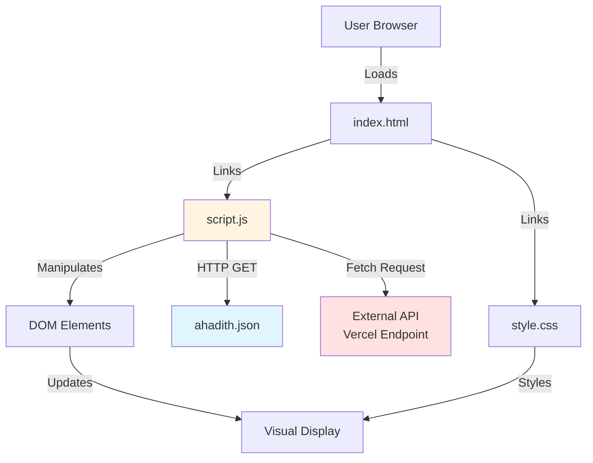
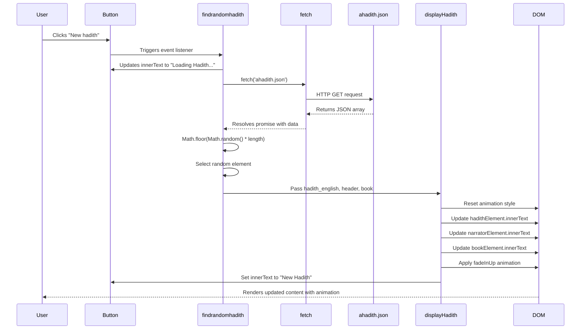
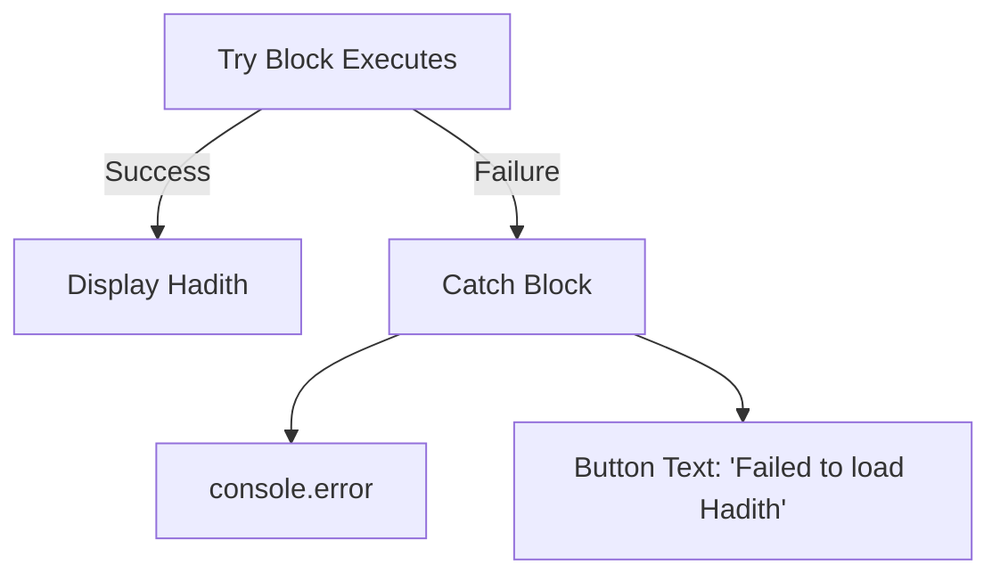

# Random Hadith Generator: Data Flow Documentation

## Table of Contents

- [Overview](#overview)
- [Repo Use Cases](#repo-use-cases)
- [High-Level Architecture](#high-level-architecture)
- [Core Components](#core-components)
- [Data Flow](#data-flow)
- [Code Implementation](#code-implementation)
- [Integration Points](#integration-points)
- [Configuration](#configuration)
- [Monitoring and Operations](#monitoring-and-operations)

## Overview

The Random Hadith Generator is a client-side web application that displays random Islamic hadith (prophetic traditions) to users. The application is a single-page application (SPA) built with vanilla JavaScript, HTML, and CSS that retrieves hadith data from a local JSON file and presents it with an animated user interface.

The system resides entirely within the browser environment with no server-side processing. It consists of three primary files: an HTML interface (`index.html`), JavaScript controller logic (`script.js`), and styling definitions (`style.css`), alongside a local data store (`ahadith.json`) containing 591 lines of hadith records.

**Key Characteristics:**

- Client-side only architecture with no backend server
- Asynchronous data fetching from local JSON file
- DOM manipulation for dynamic content updates
- CSS animation integration for visual feedback
- Responsive design supporting mobile and desktop viewports

## Repo Use Cases

### Use Case 1: Display Random Hadith on Button Click

**Trigger:** User clicks the "New hadith" button in the web interface

**Code Path:** Button click event → `findrandomhadith()` function → fetch local `ahadith.json` → random selection → `displayHadith()` → DOM update

**Output:** The hadith text, narrator name, and book reference are displayed in the UI with a fade-in animation

**Constraints:** Requires the `ahadith.json` file to be accessible via HTTP (relative path fetch). Will fail if the JSON file is malformed or inaccessible.

### Use Case 2: Load Hadith from External API

**Trigger:** The `fetchRandomHadith()` function is called (though not currently wired to the UI button)

**Code Path:** API call to `https://random-hadith-generator.vercel.app/bukhari/` → JSON response parsing → `displayHadith()` → DOM update

**Output:** Hadith content from the external Bukhari API is displayed in the UI

**Constraints:** This use case is implemented in the code but is not connected to the button click handler. The button currently calls `findrandomhadith()` instead, which uses the local JSON file.

### Use Case 3: Initial Page Load

**Trigger:** User navigates to the application URL

**Code Path:** Browser loads `index.html` → parses and renders HTML → loads linked CSS and JavaScript → displays placeholder text

**Output:** Static page is displayed with the message "Click on the 'New Hadith' button." and an empty narrator/book section

**Constraints:** None. This is a purely static rendering process.

## High-Level Architecture



**Architectural Decisions:**

- **Client-side architecture:** All processing occurs in the browser, eliminating the need for server infrastructure. This simplifies deployment to static hosting platforms.
- **Dual data source capability:** The code includes both local JSON file fetching and external API integration, though only the local approach is currently active in the UI.
- **Separation of concerns:** HTML structure, CSS presentation, and JavaScript behaviour are cleanly separated into distinct files.

## Core Components

### 1. HTML Interface (`index.html`)

**Purpose:** Defines the document structure and UI element hierarchy for the hadith display application.

**Responsibilities:**
- Declares the page metadata and viewport settings (lines 4-7)
- Links external font resources from Google Fonts (lines 8-14)
- Links FontAwesome icon library (line 15)
- Defines the container structure with header, logo, narrator/book display, and hadith text area (lines 22-38)
- Declares the action button for generating new hadith (line 35)
- Loads the JavaScript controller (line 41)

**Key Elements:**
- `#hadis` - paragraph element displaying the hadith text (line 31)
- `#narrator` - span element showing the narrator name (line 26)
- `#book` - span element showing the book reference (line 27)
- `#newb` - button element triggering hadith generation (line 35)

### 2. JavaScript Controller (`script.js`)

**Purpose:** Implements all application logic, including data fetching, random selection, and UI updates.

**Responsibilities:**
- Maintains references to DOM elements (lines 1-4)
- Fetches hadith data from external API endpoint (lines 6-17)
- Fetches hadith data from local JSON file (lines 19-31)
- Randomly selects a hadith from the local data array (line 24)
- Updates the UI with hadith content and metadata (lines 33-47)
- Manages loading states and error handling (lines 8, 14-16, 21, 28-30)
- Implements CSS animation resets for repeated clicks (lines 35-37, 44)
- Wires the button click event to the local data function (line 49)

### 3. Stylesheet (`style.css`)

**Purpose:** Defines all visual presentation, layout, and animation behaviour.

**Responsibilities:**
- Establishes the page layout with flexbox centering (lines 2-10)
- Styles the main container with background, shadow, and border (lines 13-23)
- Defines typography and colour scheme using a teal and orange palette (lines 26-35, 64-80)
- Implements the `fadeInUp` keyframe animation for hadith display (lines 242-251)
- Provides hover effects on buttons (lines 101-105, 131-135)
- Implements responsive design for mobile viewports (lines 207-217)

### 4. Local Data Store (`ahadith.json`)

**Purpose:** Serves as the primary data source containing a collection of pre-loaded hadith records.

**Structure:** JSON array containing hadith objects with the following schema:
- `id` - numeric identifier
- `header` - narrator attribution text
- `hadith_english` - English translation of the hadith text
- `narrator` - narrator name (simplified)
- `book` - source book reference (e.g., "Sahih Al-Bukhari")
- `chapter` - optional chapter reference
- `topic` - optional topic classification
- `url` - optional reference URL to sunnah.com

**Size:** 591 lines representing approximately 50+ hadith records (based on file inspection)

## Data Flow

The data flow in this application follows a request-response pattern initiated by user interaction. There are two distinct data flow paths implemented in the codebase, though only one is actively connected to the UI.

### Primary Data Flow: Local JSON File (Active Path)



**Data Flow Steps:**

1. **Event Trigger:** User interaction with the `#newb` button initiates the flow (line 49 in `script.js`)

2. **Loading State:** The button text immediately changes to "Loading Hadith..." to provide user feedback (line 21)

3. **HTTP Request:** The `fetch` API makes an asynchronous GET request to `ahadith.json` (line 22)

4. **JSON Parsing:** The response is parsed as JSON, yielding an array of hadith objects (line 23)

5. **Random Selection:** A random index is calculated using `Math.random()` scaled to the array length, then floored to an integer (line 24). This index selects one hadith object from the array (line 25)

6. **Data Extraction:** Three fields are extracted from the selected hadith object: `hadith_english`, `header`, and `book` (line 26)

7. **Display Update:** The `displayHadith()` function receives these three strings and updates the DOM (lines 33-47)

8. **Animation Reset:** The existing CSS animation is reset by setting `animation` to `'none'`, triggering a reflow, then clearing the inline style (lines 35-37)

9. **Content Update:** The three DOM elements are updated with the new text content (lines 39-41)

10. **Animation Application:** The `fadeInUp` animation is explicitly applied (line 44)

11. **Button Reset:** The button text is restored to "New Hadith" (line 46)

### Secondary Data Flow: External API (Dormant Path)

This flow is implemented in the `fetchRandomHadith()` function but is not currently connected to any UI trigger.

**Data Flow Steps:**

1. **API Request:** The function makes a fetch request to `https://random-hadith-generator.vercel.app/bukhari/` (line 9)

2. **Response Parsing:** The JSON response is parsed (line 10)

3. **Nested Data Extraction:** The hadith data is extracted from a nested structure: `data.data.hadith_english`, `data.data.header`, `data.data.book` (line 12)

4. **Display Update:** The same `displayHadith()` function is called with the extracted data (line 12)

**Difference from Local Flow:** The external API returns a nested JSON structure with the hadith data wrapped in a `data` property, whereas the local JSON file contains a flat array of hadith objects.

### Error Handling Flow

Both data paths implement similar error handling:



If the fetch operation fails (network error, malformed JSON, file not found), the catch block executes (lines 27-30 for local, lines 13-16 for API), logging the error to the console and updating the button text to indicate failure.

### Data Transformations

**Input Format (Local JSON):**
```json
{
  "id": 1,
  "header": "Narrated Abu Huraira:",
  "hadith_english": "Allah's Messenger (ﷺ) said: \"When the month of Ramadan starts...\"",
  "narrator": "Abu Huraira",
  "book": "Sahih Al-Bukhari",
  "chapter": "The Book of Fasting",
  "topic": "Fasting",
  "url": "http://sunnah.com/bukhari/30/9"
}
```

**Output Format (DOM):**
- `#hadis` receives `hadith_english` value
- `#narrator` receives `header` value
- `#book` receives `book` value

**Fields Not Used:** The `id`, `narrator`, `chapter`, `topic`, and `url` fields are fetched but not displayed in the current UI implementation.

## Code Implementation

This section traces the complete execution flow from user interaction to visual output, covering both the active local data path and the dormant API path.

### Entry Point: DOM Element References

**File: `script.js`**
```javascript
const hadithElement = document.getElementById('hadis');
const newHadithButton = document.getElementById('newb');
const narratorElement = document.getElementById('narrator');
const bookElement = document.getElementById('book');
```

**Explanation:** The JavaScript initialises by acquiring references to the four key DOM elements that will be manipulated during the application lifecycle. These constants are used throughout the subsequent functions to read and write element content. The `getElementById` calls execute immediately when the script loads, establishing the connection between JavaScript logic and HTML structure.

### Primary Path: Local JSON Data Fetching

**File: `script.js`**
```javascript
async function findrandomhadith() {
  try {
    newHadithButton.innerText = 'Loading Hadith...';
    const response = await fetch('ahadith.json');
    const dataarray = await response.json();
    const randomIndex = Math.floor(Math.random() * dataarray.length);
    const data = dataarray[randomIndex];
    displayHadith(data.hadith_english, data.header, data.book);
  } catch (error) {
    console.error('Error fetching Hadith:', error);
    newHadithButton.innerText = 'Failed to load Hadith';
  }
}
```

**Explanation:** This asynchronous function orchestrates the primary data flow. It begins by immediately updating the button text to provide user feedback (line 21), preventing confusion during the fetch operation. The `fetch` call on line 22 initiates an HTTP GET request for the local JSON file. The relative path `'ahadith.json'` resolves to the file in the same directory as the HTML document. The first `await` pauses execution until the HTTP response is received, then the second `await` on line 23 pauses again until the response body is fully parsed as JSON. Line 24 generates a random integer between 0 and the array length minus one using the standard JavaScript randomisation pattern. Line 25 uses this index to select one hadith object from the array. Line 26 extracts three specific properties and passes them to the display function. The catch block on lines 27-30 handles any errors during the fetch or parse operations, including network failures, 404 errors, or malformed JSON, providing both developer feedback via console and user feedback via button text.

### Secondary Path: External API Data Fetching

**File: `script.js`**
```javascript
async function fetchRandomHadith() {
  try {
    newHadithButton.innerText = 'Loading Hadith...';
    const response = await fetch('https://random-hadith-generator.vercel.app/bukhari/');
    const data = await response.json();
    console.log(data);
    displayHadith(data.data.hadith_english, data.data.header, data.data.book);
  } catch (error) {
    console.error('Error fetching Hadith:', error);
    newHadithButton.innerText = 'Failed to load Hadith';
  }
}
```

**Explanation:** This function implements an alternative data source using an external API endpoint hosted on Vercel. The structure mirrors `findrandomhadith()` with three key differences: (1) the fetch URL points to an external HTTPS endpoint rather than a local file (line 9), (2) the API returns a nested structure requiring `data.data` access rather than direct array indexing (line 12), and (3) a `console.log` statement on line 11 provides debugging visibility into the API response structure. This function is not currently invoked by any event listener in the codebase, making it a dormant alternative implementation. The API endpoint is expected to return a random hadith on each request, eliminating the need for client-side randomisation.

### Display and Animation Logic

**File: `script.js`**
```javascript
function displayHadith(hadith, narrator, book) {
  // Reset animation
  hadithElement.style.animation = 'none';
  hadithElement.offsetHeight; // trigger reflow
  hadithElement.style.animation = '';

  hadithElement.innerText = hadith;
  narratorElement.innerText = narrator;
  bookElement.innerText = book;

  // Apply animation
  hadithElement.style.animation = 'fadeInUp 1s forwards';

  newHadithButton.innerText = 'New Hadith';
}
```

**Explanation:** This function serves as the final stage of the data flow, transforming fetched data into visible UI updates. Lines 35-37 implement a critical animation reset technique: setting the animation property to `'none'` cancels any in-progress animation, accessing `offsetHeight` forces a browser reflow (the read operation flushes pending style changes), and setting the animation property to an empty string removes the inline override, allowing the CSS to take effect again. This pattern ensures that clicking "New Hadith" multiple times in succession triggers the animation each time rather than having it play only once. Lines 39-41 perform the core content updates by setting the `innerText` properties of the three display elements. The use of `innerText` rather than `innerHTML` provides implicit XSS protection by rendering any HTML entities as plain text rather than parsing them. Line 44 explicitly applies the `fadeInUp` animation with a 1-second duration and `forwards` fill mode, which retains the animation's final state after completion. Line 46 resets the button text to its default state, completing the user feedback cycle.

### Event Binding

**File: `script.js`**
```javascript
newHadithButton.addEventListener('click', findrandomhadith);
```

**Explanation:** This single line establishes the connection between user interaction and application logic. The `addEventListener` call registers `findrandomhadith` as the handler for click events on the button element. Notably, the function reference is passed without parentheses, ensuring it is invoked only when the event fires rather than during registration. This line is why the local JSON path is active whilst the API path remains dormant—changing this to `fetchRandomHadith` would switch to the external API data source.

### HTML Structure Definition

**File: `index.html`**
```html
<div class="container">
  <header>Hadith of the day</header>
  
  <div class="narrator-book-container">
    <span id="narrator" class="narrator"></span>
    <span id="book" class="book"></span>
  </div>
  <div class="content">
    <div class="textarea">
      <p id="hadis" class="hadis">Click on the "New Hadith" button.</p>
    </div>
    <div class="buttons">
      <div class="feature">
        <button id="newb" class="newb">New hadith</button>
      </div>
    </div>
  </div>
</div>
```

**Explanation:** This HTML fragment (lines 22-39) defines the complete UI structure. The `.container` div serves as the root element for all visual content. The `header` element displays the application title (line 23). The logo image is positioned absolutely via CSS (line 24). The `.narrator-book-container` div on lines 25-28 creates a flex container for the narrator and book spans, which are initially empty and populated only after the first hadith fetch. The `#hadis` paragraph on line 31 contains placeholder text that guides the user to click the button, establishing the expected interaction pattern. The button element on line 35 is both the visual trigger and the event target that initiates the data flow.

### Animation Implementation

**File: `style.css`**
```css
@keyframes fadeInUp {
    from {
        opacity: 0;
        transform: translateY(80px);
    }
    to {
        opacity: 1;
        transform: translateY(0);
    }
}
```

**Explanation:** This CSS keyframe definition (lines 242-251) creates the visual transition applied to hadith content. The animation begins with the element fully transparent (`opacity: 0`) and positioned 80 pixels below its final location (`translateY(80px)`). Over the course of the animation duration (1 second as specified in the JavaScript), these properties transition to full opacity and zero vertical offset, creating a fade-in and slide-up effect. The `forwards` fill mode specified in JavaScript ensures the element remains at full opacity after the animation completes rather than reverting to its initial state.

**File: `style.css`**
```css
.hadis {
    font-family: 'Nunito Sans', sans-serif;
    font-size: 24px;
    margin-bottom: 20px;
    color: #6a7b7f;
    text-shadow: 1px 1px 2px rgba(0, 0, 0, 0.1);
    padding: 10px;
    border-left: 4px solid #035d6f;
    background: rgba(255, 255, 255, 0.8);
    border-radius: 10px;
    box-shadow: 0 5px 10px rgba(0, 0, 0, 0.1);
    position: relative;
    opacity: 0;
    transform: translateY(20px);
    animation: fadeInUp 1s forwards;
}
```

**Explanation:** The `.hadis` class styles (lines 65-80) establish the default visual presentation of the hadith text. Lines 77-78 set the initial animation state to match the `from` keyframe (though with a smaller transform offset of 20px), whilst line 79 applies the animation by default. The JavaScript animation reset technique works by temporarily overriding this CSS animation property, then allowing it to reapply, creating the appearance of a fresh animation on each content update.

### Data Structure Example

**File: `ahadith.json`**
```json
{
    "id": 1,
    "header": "Narrated Abu Huraira:",
    "hadith_english": "Allah's Messenger (ﷺ) said: \"When the month of Ramadan starts, the gates of the heaven are opened and the gates of Hell are closed and the devils are chained.\"",
    "narrator": "Abu Huraira",
    "book": "Sahih Al-Bukhari",
    "chapter": "The Book of Fasting",
    "topic": "Fasting",
    "url": "http://sunnah.com/bukhari/30/9"
}
```

**Explanation:** This representative object (lines 2-11) demonstrates the structure of each hadith record in the local data source. The `hadith_english` property contains the full text that appears in the main display area. The `header` property provides the narrator attribution, which appears in the left span element. The `book` property identifies the source collection, appearing in the right span element. The `id`, `narrator`, `chapter`, `topic`, and `url` properties are present in the data but are not consumed by the current implementation, representing potential data for future feature enhancements such as filtering by topic, linking to source URLs, or displaying chapter context.

### Execution Flow Summary

1. **Page Load:** Browser parses HTML, loads CSS and JavaScript, executes script.js
2. **Initialisation:** Four `const` declarations create DOM element references (lines 1-4)
3. **Event Registration:** Click listener binds button to `findrandomhadith` function (line 49)
4. **User Interaction:** User clicks the "New hadith" button
5. **Loading Feedback:** Button text changes to "Loading Hadith..." (line 21)
6. **HTTP Request:** Fetch initiates GET request for `ahadith.json` (line 22)
7. **Response Reception:** Promise resolves with Response object
8. **JSON Parsing:** Response body parsed into JavaScript array (line 23)
9. **Random Selection:** Random index calculated and used to select one object (lines 24-25)
10. **Property Extraction:** Three string properties extracted from selected object (line 26)
11. **Display Invocation:** `displayHadith` function called with three string arguments (line 26)
12. **Animation Reset:** Existing animation cleared via style manipulation (lines 35-37)
13. **Content Update:** Three DOM elements receive new text content (lines 39-41)
14. **Animation Application:** FadeInUp animation applied to hadith element (line 44)
15. **Button Reset:** Button text restored to "New Hadith" (line 46)
16. **Visual Rendering:** Browser renders updated DOM with animation over 1 second

**Error Branch:** If any error occurs during steps 6-9, execution jumps to the catch block, which logs the error (line 28) and sets the button text to "Failed to load Hadith" (line 29), preventing silent failures.

## Integration Points

### Local File System

**Type:** Static file serving via HTTP

**Usage:** The application fetches `ahadith.json` using a relative path, which requires the file to be served via HTTP rather than accessed through the `file://` protocol. This integration is implicit in the fetch API call.

**Location:** `script.js:22`

**Requirements:** The JSON file must be located in the same directory as `index.html` and must be served by a web server (local development server or static hosting platform). Direct file system access via `file://` URLs will fail due to CORS restrictions in modern browsers.

**Data Format:** JSON array of hadith objects with the schema documented in the Core Components section.

### External API (Dormant)

**Type:** RESTful HTTP API

**Endpoint:** `https://random-hadith-generator.vercel.app/bukhari/`

**Usage:** The `fetchRandomHadith()` function includes integration with an external hadith API hosted on Vercel, though this integration is not currently active in the UI.

**Location:** `script.js:9`

**Request Method:** GET

**Response Format:**
```json
{
  "data": {
    "hadith_english": "string",
    "header": "string",
    "book": "string"
  }
}
```

**Error Handling:** Network errors, timeouts, and non-200 status codes are caught and logged (lines 13-16).

**Current Status:** This integration is implemented but not connected to any UI trigger. The button click handler is wired to `findrandomhadith` (local JSON) rather than `fetchRandomHadith` (external API).

### Google Fonts CDN

**Type:** External stylesheet and font file hosting

**Usage:** The application loads multiple web font families from Google Fonts to style text content.

**Location:** `index.html:8-14`

**Fonts Loaded:**
- Aboreto
- Alkalami
- Baloo Bhai 2
- Baloo Bhaina 2
- Bree Serif
- Courgette
- Indie Flower
- Kanit (weights 100, 200, 900)
- Nunito Sans (variable opsz 6-12, weight 500)
- Poppins (weight 500)
- Quicksand
- Raleway
- Roboto Mono (italic, weight 300)
- Shadows Into Light

**Primary Font Usage:** The hadith text specifically uses 'Nunito Sans' as defined in `style.css:66`.

### FontAwesome Icon Library

**Type:** External JavaScript icon library

**Usage:** FontAwesome Kit is loaded for potential icon usage in the UI.

**Location:** `index.html:15`

**Kit ID:** `7c3e43e755`

**Current Status:** The library is loaded but no FontAwesome icons are evident in the current HTML structure, suggesting this may be a legacy dependency or prepared for future enhancement.

### Browser APIs

**Speech Synthesis API (Unused):**
The `doc/doc` file references a Speech Synthesis implementation that is not present in the current `script.js`, indicating this feature may have been removed or documented incorrectly:

```javascript
const utterance = new SpeechSynthesisUtterance(hadithElement.innerText);
utterance.lang = 'ar-SA';
window.speechSynthesis.speak(utterance);
```

**Current Status:** Not implemented in the active codebase, only referenced in documentation.

## Configuration

The application has no explicit configuration system. All operational parameters are hard-coded within the source files.

### Hard-Coded Configuration Values

**Data Source (Local Path):**
- **Location:** `script.js:22`
- **Value:** `'ahadith.json'`
- **Purpose:** Relative path to the local hadith data file
- **Modification:** Changing this value would point to a different JSON file

**Data Source (API Endpoint):**
- **Location:** `script.js:9`
- **Value:** `'https://random-hadith-generator.vercel.app/bukhari/'`
- **Purpose:** External API endpoint for hadith data
- **Current Status:** Implemented but not active

**Active Data Source Selection:**
- **Location:** `script.js:49`
- **Value:** `findrandomhadith` function reference
- **Purpose:** Determines which data source function is triggered by button clicks
- **Modification:** Changing this to `fetchRandomHadith` would switch to the API data source

**Animation Duration:**
- **Location:** `script.js:44`
- **Value:** `'fadeInUp 1s forwards'`
- **Purpose:** Controls the duration and behaviour of the hadith display animation
- **Modification:** The `1s` value can be adjusted to make the animation faster or slower

**Animation Transform Offset:**
- **Location:** `style.css:245`
- **Value:** `translateY(80px)`
- **Purpose:** Determines how far below its final position the hadith begins during animation
- **Modification:** Higher values create a more dramatic slide-up effect

**Colour Scheme:**
- **Primary Colour (Teal):** `#035d6f` (used for borders, button background)
- **Secondary Colour (Orange):** `#e27c39` (used for hover states)
- **Text Colour:** `#6a7b7f` (medium grey)
- **Background:** `#fcfdfd` (near-white)

These values are distributed throughout `style.css` and would need to be changed in multiple locations to alter the colour scheme consistently.

### Environment-Specific Behaviour

The application behaviour does not vary across environments. However, deployment environment affects data access:

**Local Development:**
Requires a local web server (e.g., `python -m http.server`, `npx serve`, or VS Code Live Server extension) to serve files and avoid CORS restrictions on the `ahadith.json` fetch.

**Static Hosting (GitHub Pages, Netlify, Vercel):**
Works without modification as these platforms automatically serve all files via HTTP/HTTPS.

**File System Access:**
Opening `index.html` directly via `file://` protocol will fail when attempting to fetch `ahadith.json` due to browser security restrictions.

### No Configuration Files

The repository contains no configuration files such as:
- `.env` files for environment variables
- `config.json` or similar configuration documents
- Build configuration (no webpack, parcel, or bundler configuration evident)
- Package manager manifests (`package.json` is not present)

All configuration is embedded directly in source code, requiring code changes to modify behaviour.

## Monitoring and Operations

### Error Logging

The application implements basic console logging for error conditions.

**File: `script.js`**
```javascript
console.error('Error fetching Hadith:', error);
```

**Location:** Lines 14 and 28 (both data paths implement identical error logging)

**Behaviour:** When a fetch operation fails, the error object is logged to the browser's developer console with a descriptive prefix. This provides debugging visibility into network failures, CORS errors, malformed JSON, or 404 responses.

**User Feedback:** In addition to console logging, the button text is updated to "Failed to load Hadith" (lines 15 and 29), providing user-visible error indication without requiring console access.

### Debug Logging

**File: `script.js`**
```javascript
console.log(data);
```

**Location:** Line 11 (only in the `fetchRandomHadith` function)

**Behaviour:** The external API data path includes a console.log statement that outputs the complete API response structure. This aids in understanding the API response format during development or debugging.

**Current Status:** This logging is only present in the dormant API path, not in the active local JSON path.

### Operational Characteristics

**Loading States:**
The application provides user feedback during asynchronous operations by updating button text to "Loading Hadith..." immediately when a fetch begins, then restoring it to either "New Hadith" on success or "Failed to load Hadith" on error.

**Performance:**
- **Initial Page Load:** Minimal - no JavaScript execution required for initial render
- **First Hadith Load:** Single HTTP request for `ahadith.json` (file size not measured but contains ~50 hadith records across 591 lines)
- **Subsequent Hadith Loads:** Zero network requests - random selection from already-loaded data array
- **Animation Performance:** CSS-based animation offloads work to GPU, maintaining smooth 60fps rendering

**Caching Behaviour:**
The `ahadith.json` file is fetched once per page load. Subsequent button clicks reuse the already-parsed array in memory. Browser HTTP caching may prevent re-fetching on page reload depending on cache headers served by the hosting platform.

**Failure Modes:**

1. **Network Failure During Initial Fetch:**
   - Symptom: Button displays "Failed to load Hadith"
   - Console: Error logged with network details
   - Recovery: User must refresh page or retry button click (though retry will fail until network recovers)

2. **Malformed JSON:**
   - Symptom: Button displays "Failed to load Hadith"
   - Console: JSON parse error logged
   - Recovery: Requires fixing the JSON file and refreshing page

3. **Missing DOM Elements:**
   - Symptom: JavaScript execution fails silently
   - Console: No error logged (accessing null properties would throw TypeError)
   - Impact: Page renders but button clicks have no effect

4. **File Not Found (404):**
   - Symptom: Same as network failure
   - Console: 404 error logged
   - Recovery: Requires ensuring `ahadith.json` is in correct location

**Health Monitoring:**
The application has no health check endpoints, metrics emission, or uptime monitoring. As a static client-side application, health is binary: the page either loads successfully or fails to load. There is no server-side component to monitor.

**Browser Compatibility:**
The code relies on modern JavaScript features:
- `async/await` syntax (requires ES2017+ support)
- `fetch` API (requires modern browser or polyfill)
- `const/let` declarations (ES2015+)
- Arrow functions not used, but standard functions compatible with ES5+

Legacy browser support would require transpilation (Babel) and polyfills (fetch, Promise).

**Deployment Considerations:**

The application is deployment-ready as a static site with no build process required. All files can be deployed directly to any static hosting platform. The only operational requirement is that files must be served via HTTP/HTTPS rather than accessed through the file system.

**No Observability Infrastructure:**

The application does not integrate with:
- Application Performance Monitoring (APM) tools
- Error tracking services (Sentry, Rollbar, etc.)
- Analytics platforms (Google Analytics, etc.)
- Logging aggregation services
- Distributed tracing systems

All observability is limited to browser developer console output, which is only accessible to individual users and not aggregated across sessions.
