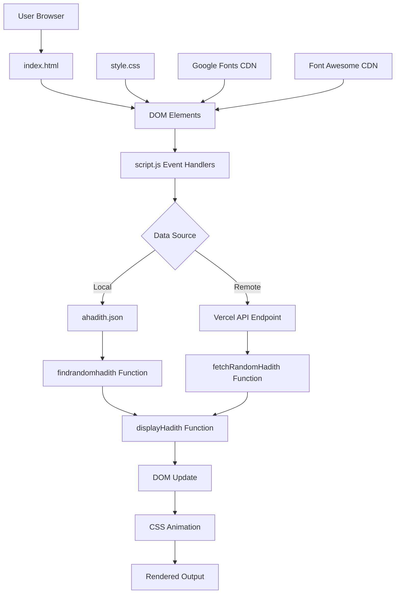
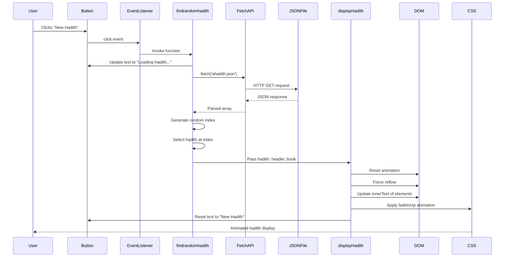

# Random Hadith Generator System - Technical Documentation

## Table of Contents

1. [Overview](#overview)
2. [Repo Use Cases](#repo-use-cases)
3. [High-Level Architecture](#high-level-architecture)
4. [Core Components](#core-components)
5. [Data Flow](#data-flow)
6. [Code Implementation](#code-implementation)
7. [Integration Points](#integration-points)
8. [Configuration](#configuration)
9. [Monitoring and Operations](#monitoring-and-operations)

---

## Overview

The Random Hadith Generator is a client-side web application designed to display random Islamic hadiths (prophetic traditions) to users. The system operates as a single-page application (SPA) that retrieves hadith data from either a local JSON data source or an external API endpoint and presents the content in a visually appealing, responsive interface.

The application sits within a standalone repository as a complete, self-contained frontend system with no backend server component. It relies entirely on browser-based JavaScript for functionality and data presentation.

**Key Characteristics:**

1. **Client-side architecture** - Entirely browser-based with no server-side processing requirements
2. **Dual data source capability** - Can fetch hadiths from either a local JSON file or an external REST API
3. **Animated presentation** - Implements CSS animations for smooth content transitions when displaying new hadiths
4. **Responsive design** - Mobile-first styling with media queries for various screen sizes
5. **Zero build dependencies** - Vanilla JavaScript implementation with no compilation or bundling required

---

## Repo Use Cases

### Use Case 1: Display Random Hadith from Local Data Source

**Trigger:** User clicks the "New Hadith" button

**Entry Point:** `script.js:49` - Click event listener on the "New Hadith" button

**Execution Flow:**
- The `findrandomhadith()` function is invoked
- Local `ahadith.json` file is fetched via browser Fetch API
- A random index is generated to select one hadith from the 58+ available entries
- Selected hadith content is passed to the display function
- DOM elements are updated with hadith text, narrator information, and book reference

**Expected Outcome:** A randomly selected hadith appears on the page with fade-in animation, displaying the English translation, narrator name, and source book

**Components Involved:** Event handler (script.js:49), `findrandomhadith()` function (script.js:19-31), `displayHadith()` function (script.js:33-47), DOM elements (index.html:26-31)

### Use Case 2: Retrieve Hadith from External API

**Trigger:** Direct invocation of `fetchRandomHadith()` function (currently not wired to UI)

**Entry Point:** `script.js:6` - `fetchRandomHadith()` function definition

**Execution Flow:**
- HTTP GET request sent to `https://random-hadith-generator.vercel.app/bukhari/`
- API response parsed as JSON
- Nested data structure extracted (`data.data.hadith_english`, `data.data.header`, `data.data.book`)
- Content displayed via `displayHadith()` function

**Expected Outcome:** Hadith from Sahih Al-Bukhari collection retrieved from remote API and displayed

**Important Constraint:** This function is defined but not currently attached to any user interaction. The application defaults to local JSON data source via `findrandomhadith()`.

### Use Case 3: Animated Content Presentation

**Trigger:** Any successful hadith retrieval (local or remote)

**Entry Point:** `script.js:33` - `displayHadith()` function

**Execution Flow:**
- Existing CSS animation is cancelled by setting `animation` property to `'none'`
- Browser reflow is forced by accessing `offsetHeight` property
- Animation property is reset to empty string to re-enable animation
- New hadith text, narrator, and book reference are set via `innerText`
- `fadeInUp` animation is explicitly applied
- Button text is reset to "New Hadith"

**Expected Outcome:** Smooth fade-in transition from bottom to top (80px upward translation) over 1 second as new hadith appears

**Components Involved:** `displayHadith()` function (script.js:33-47), CSS `@keyframes fadeInUp` rule (style.css:242-251), `.hadis` element styling (style.css:65-80)

---

## High-Level Architecture



**Architectural Decisions:**

1. **Single-page application pattern** - The entire application loads once; subsequent interactions modify the DOM without page reloads. This is evidenced by the absence of any form submissions or navigation elements in `index.html`.

2. **Dual data source strategy** - Two separate fetch functions exist (`fetchRandomHadith` and `findrandomhadith`), suggesting the system was designed to support both offline operation (local JSON) and online operation (remote API). Currently, only the local source is wired to the UI (script.js:49).

3. **Progressive enhancement approach** - The application displays a default message ("Click on the 'New Hadith' button") before any user interaction, ensuring usability even if JavaScript fails to load.

4. **Separation of concerns** - Data retrieval, data transformation, and presentation logic are separated into distinct functions within `script.js`.

---

## Core Components

### 1. HTML Structure - `index.html`

**Purpose:** Provides the semantic structure and initial DOM elements for the application

**Key Responsibilities:**
- Defines the application container with class `container` (line 22)
- Establishes header element displaying "Hadith of the day" (line 23)
- Embeds application logo image (line 24)
- Creates output elements for narrator (`#narrator`), book (`#book`), and hadith text (`#hadis`)
- Includes "New Hadith" button with id `newb` (line 35)
- Links external stylesheets and font resources (lines 8-15)
- References Font Awesome icon library (line 15)

**File Reference:** `index.html:1-45`

### 2. JavaScript Controller - `script.js`

**Purpose:** Implements all application logic, including event handling, data retrieval, randomisation, and DOM manipulation

**Key Responsibilities:**
- Manages DOM element references (lines 1-4)
- Implements `fetchRandomHadith()` for remote API calls (lines 6-17)
- Implements `findrandomhadith()` for local JSON retrieval (lines 19-31)
- Implements `displayHadith()` for content presentation (lines 33-47)
- Attaches click event listener to trigger hadith retrieval (line 49)

**File Reference:** `script.js:1-50`

### 3. Stylesheet - `style.css`

**Purpose:** Defines all visual presentation, layout, animations, and responsive behaviour

**Key Responsibilities:**
- Establishes centred flex layout for body (lines 2-10)
- Styles main container with background, borders, shadows, and backdrop blur (lines 13-23)
- Defines header typography and decorative effects (lines 26-50)
- Implements hadith quotation styling with decorative quotation marks (lines 65-80, 188-204)
- Styles interactive button with hover and active states (lines 88-110, 121-135)
- Positions and styles logo with hover animation (lines 139-167)
- Implements `fadeInUp` keyframe animation (lines 242-251)
- Provides responsive design adjustments for screens under 768px width (lines 207-217)

**File Reference:** `style.css:1-252`

### 4. Hadith Data Store - `ahadith.json`

**Purpose:** Serves as the local data source containing a curated collection of hadiths

**Key Responsibilities:**
- Stores 58+ hadith entries as a JSON array
- Provides structured data fields for each hadith: `id`, `header`, `hadith_english`, `narrator`, `book`, `chapter`, `topic`, `url`
- Enables offline functionality and reduces dependency on external services

**Data Structure Example:**
```json
{
  "id": 1,
  "header": "Narrated Abu Huraira:",
  "hadith_english": "Allah's Messenger (ﷺ) said: \"When the month of Ramadan starts...\"",
  "narrator": "Abu Huraira",
  "book": "Sahih Al-Bukhari",
  "chapter": "The Book of Fasting",
  "topic": "Fasting",
  "url": "http://sunnah.com/bukhari/30/9"
}
```

**File Reference:** `ahadith.json:1-591`

**Note:** The JSON file contains additional fields (`chapter`, `topic`, `url`) that are not currently utilised by the `displayHadith()` function. Only `hadith_english`, `header`, and `book` are displayed.

---

## Data Flow

The system implements two distinct data flow paths depending on the data source selected. Currently, only the local JSON path is active in the deployed application.

### Primary Data Flow: Local JSON Retrieval



**Data Transformations:**

1. **JSON Array → Individual Hadith Object**: Random selection via `Math.floor(Math.random() * dataarray.length)` (script.js:24)
2. **Hadith Object → Display Parameters**: Destructuring of `data.hadith_english`, `data.header`, `data.book` fields (script.js:26)
3. **Display Parameters → DOM Text Content**: Direct assignment to `innerText` properties (script.js:39-41)

**State Transitions:**

1. **Idle State**: Button displays "New Hadith"
2. **Loading State**: Button displays "Loading Hadith..." (script.js:21)
3. **Display State**: Button returns to "New Hadith", content visible (script.js:46)
4. **Error State**: Button displays "Failed to load Hadith" (script.js:29)

### Secondary Data Flow: Remote API Retrieval (Inactive)

This flow is implemented in code but not currently connected to user interactions.

**Endpoint:** `https://random-hadith-generator.vercel.app/bukhari/`

**Expected Response Structure:**
```json
{
  "data": {
    "hadith_english": "...",
    "header": "...",
    "book": "..."
  }
}
```

**Key Difference:** Remote API response requires accessing nested `data.data` property structure (script.js:12), whereas local JSON provides flat array structure.

---

## Code Implementation

This section traces the complete execution flow from user interaction to visual presentation.

### Entry Point: User Interaction

**File: `index.html`**
```html
<button id="newb" class="newb">New hadith</button>
```

**Explanation:** The primary interaction element is a button with id `newb`. When clicked, this triggers the main application flow.

**File: `script.js`**
```javascript
const newHadithButton = document.getElementById('newb');
```

**Explanation:** The button element is captured during script initialisation (line 2) and stored in a module-level constant for reuse across functions.

### Event Handler Registration

**File: `script.js`**
```javascript
newHadithButton.addEventListener('click', findrandomhadith);
```

**Explanation:** Line 49 registers the `findrandomhadith` function as the click event handler. This wiring establishes the local JSON file as the active data source. Notably, `fetchRandomHadith` (the remote API function) is not registered to any event, indicating it may be legacy code or reserved for future use.

### Data Retrieval: Local JSON Source

**File: `script.js`**
```javascript
async function findrandomhadith() {
  try {
    newHadithButton.innerText = 'Loading Hadith...';
    const response = await fetch('ahadith.json');
    const dataarray = await response.json();
    const randomIndex = Math.floor(Math.random() * dataarray.length);
    const data = dataarray[randomIndex];
    displayHadith(data.hadith_english, data.header, data.book);
  } catch (error) {
    console.error('Error fetching Hadith:', error);
    newHadithButton.innerText = 'Failed to load Hadith';
  }
}
```

**Explanation:** This asynchronous function (lines 19-31) implements the core data retrieval logic:

1. **Loading state indication** (line 21): Button text is immediately updated to provide user feedback
2. **Fetch operation** (line 22): Browser Fetch API retrieves `ahadith.json` from the same origin
3. **JSON parsing** (line 23): Response body is parsed as JSON, yielding an array of hadith objects
4. **Randomisation** (line 24): `Math.random()` generates a pseudo-random float [0, 1), multiplied by array length and floored to produce a valid array index
5. **Selection** (line 25): The hadith object at the random index is extracted
6. **Display delegation** (line 26): Three fields are extracted and passed to the presentation function
7. **Error handling** (lines 27-30): Network failures, parse errors, or undefined properties trigger console logging and user-facing error message

**Important Implementation Detail:** The function accesses `data.hadith_english`, `data.header`, and `data.book` but ignores `data.chapter`, `data.topic`, and `data.url` fields that exist in the JSON structure. This suggests potential for feature expansion.

### Alternative Data Retrieval: Remote API (Inactive)

**File: `script.js`**
```javascript
async function fetchRandomHadith() {
  try {
    newHadithButton.innerText = 'Loading Hadith...';
    const response = await fetch('https://random-hadith-generator.vercel.app/bukhari/');
    const data = await response.json();
    console.log(data);
    displayHadith(data.data.hadith_english, data.data.header, data.data.book);
  } catch (error) {
    console.error('Error fetching Hadith:', error);
    newHadithButton.innerText = 'Failed to load Hadith';
  }
}
```

**Explanation:** This function (lines 6-17) mirrors the structure of `findrandomhadith()` with two key differences:

1. **API endpoint** (line 9): Fetches from external Vercel deployment rather than local file
2. **Data path** (line 12): Accesses nested `data.data` structure rather than array element, indicating different API response shape

The `console.log(data)` statement on line 11 suggests this function may have been used for debugging or development purposes.

### Presentation Layer: DOM Manipulation and Animation

**File: `script.js`**
```javascript
function displayHadith(hadith, narrator, book) {
  // Reset animation
  hadithElement.style.animation = 'none';
  hadithElement.offsetHeight; // trigger reflow
  hadithElement.style.animation = '';

  hadithElement.innerText = hadith;
  narratorElement.innerText = narrator;
  bookElement.innerText = book;

  // Apply animation
  hadithElement.style.animation = 'fadeInUp 1s forwards';

  newHadithButton.innerText = 'New Hadith';
}
```

**Explanation:** The `displayHadith()` function (lines 33-47) handles all presentation logic:

1. **Animation reset** (line 35): Setting `animation` to `'none'` stops any in-progress animation
2. **Forced reflow** (line 36): Reading `offsetHeight` forces the browser to recalculate layout, ensuring the animation reset takes effect before the next frame. This is a critical technique for restarting CSS animations.
3. **Animation re-enable** (line 37): Clearing the animation property allows CSS rules to reapply
4. **Content update** (lines 39-41): The three text elements are updated with new content via direct assignment to `innerText` properties
5. **Animation application** (line 44): The `fadeInUp` animation is explicitly applied with 1-second duration and `forwards` fill mode (maintains final state)
6. **UI state reset** (line 46): Button text returns to default state

**DOM Element References:**

**File: `script.js`**
```javascript
const hadithElement = document.getElementById('hadis');
const narratorElement = document.getElementById('narrator');
const bookElement = document.getElementById('book');
```

**Explanation:** These constants (lines 1, 3, 4) are established at script load time, avoiding repeated DOM queries and improving performance.

### Visual Presentation: CSS Animation

**File: `style.css`**
```css
@keyframes fadeInUp {
    from {
        opacity: 0;
        transform: translateY(80px);
    }
    to {
        opacity: 1;
        transform: translateY(0);
    }
}
```

**Explanation:** The `fadeInUp` animation (lines 242-251) defines a two-state transition:

- **Initial state**: Content is invisible (`opacity: 0`) and positioned 80 pixels below its final location
- **Final state**: Content is fully visible and in its natural position

This creates a smooth upward fade-in effect that enhances the user experience when new content appears.

**File: `style.css`**
```css
.hadis {
    font-family: 'Nunito Sans', sans-serif;
    font-size: 24px;
    margin-bottom: 20px;
    color: #6a7b7f;
    text-shadow: 1px 1px 2px rgba(0, 0, 0, 0.1);
    padding: 10px;
    border-left: 4px solid #035d6f;
    background: rgba(255, 255, 255, 0.8);
    border-radius: 10px;
    box-shadow: 0 5px 10px rgba(0, 0, 0, 0.1);
    position: relative;
    opacity: 0;
    transform: translateY(20px);
    animation: fadeInUp 1s forwards;
}
```

**Explanation:** The `.hadis` class (lines 65-80) applies default styling to the hadith text container:

- Line 77 sets initial `opacity: 0` to hide content before animation
- Line 78 sets initial downward offset via `transform: translateY(20px)`
- Line 79 applies the `fadeInUp` animation by default

This creates a consistent animation on first load and whenever new content is displayed.

### Error Handling Implementation

**File: `script.js`**
```javascript
try {
    // ... fetch and process logic
} catch (error) {
    console.error('Error fetching Hadith:', error);
    newHadithButton.innerText = 'Failed to load Hadith';
}
```

**Explanation:** Both data retrieval functions implement identical error handling patterns (script.js:27-30 and 14-16):

1. **Console logging**: Errors are logged with descriptive prefix for debugging
2. **User feedback**: Button text changes to indicate failure, preventing confusion if content doesn't update
3. **No retry mechanism**: Failed requests must be manually retried by clicking the button again

**Potential Failure Scenarios:**
- Network connectivity issues preventing fetch from completing
- Malformed JSON in `ahadith.json` causing parse errors
- Missing or renamed `ahadith.json` file resulting in 404 response
- CORS issues when accessing external API (though not applicable to same-origin local file)
- Accessing undefined properties if API response structure changes

### Responsive Design Implementation

**File: `style.css`**
```css
@media (max-width: 768px) {
    .container {
        width: 90%;
    }
    .logo {
        width: 40px;
    }
    .buttons button {
        margin: 10px 0;
    }
}
```

**Explanation:** The media query (lines 207-217) adjusts layout for mobile devices:

- Container expands to 90% width for better screen utilisation
- Logo size reduces significantly (from 160px to 40px) to prevent visual clutter
- Button margins shift from horizontal to vertical spacing for stacked layout

This ensures usability across device sizes without requiring separate mobile templates.

---

## Integration Points

### 1. External API Endpoint (Inactive)

**URL:** `https://random-hadith-generator.vercel.app/bukhari/`

**Purpose:** Provides random hadiths from Sahih Al-Bukhari collection via REST API

**Integration Location:** `script.js:9` - `fetchRandomHadith()` function

**Protocol:** HTTPS GET request via Fetch API

**Expected Response Format:**
```json
{
  "data": {
    "hadith_english": "String containing English translation",
    "header": "String containing narrator and attribution",
    "book": "String containing source book name"
  }
}
```

**Authentication:** None evident from code

**Error Handling:** Generic try-catch block captures all failure modes; no specific retry logic or fallback mechanism

**Current Status:** Function is defined but not connected to UI event handlers. The `findrandomhadith()` function is used instead, suggesting this may be legacy code or reserved for future implementation.

### 2. Local Data Source

**File:** `ahadith.json`

**Purpose:** Serves as the primary data source for hadith content, enabling offline functionality

**Integration Location:** `script.js:22` - `findrandomhadith()` function

**Protocol:** Browser Fetch API with relative path, resolved to same origin as HTML document

**Data Format:** JSON array containing 58+ hadith objects with consistent schema

**Fields Utilised:** `hadith_english`, `header`, `book`

**Fields Available But Unused:** `id`, `narrator`, `chapter`, `topic`, `url`

**Maintenance Consideration:** The JSON file must be manually curated and updated. No automated synchronisation with external sources is evident.

### 3. Google Fonts CDN

**Purpose:** Provides web fonts for typography across the application

**Integration Location:** `index.html:8-14`

**Fonts Loaded:**
- Aboreto
- Alkalami
- Baloo Bhai 2
- Baloo Bhaina 2
- Bree Serif
- Courgette
- Indie Flower
- Kanit (weights 100, 200, 900)
- Nunito Sans (used for hadith text)
- Poppins (weight 500)
- Quicksand
- Raleway
- Roboto Mono (italic, weight 300)
- Shadows Into Light

**Protocol:** HTTPS via `<link>` tags with `rel="stylesheet"`

**Performance Consideration:** Multiple separate font requests (five distinct `<link>` elements) may impact initial page load performance. Several fonts appear unused in the stylesheet, suggesting potential for optimisation.

### 4. Font Awesome Icon Library

**Purpose:** Provides icon font resources (though no icons are currently visible in the implementation)

**Integration Location:** `index.html:15`

**URL:** `https://kit.fontawesome.com/7c3e43e755.js`

**Protocol:** JavaScript SDK loaded via `<script>` tag

**Current Usage:** No Font Awesome classes are present in the HTML markup, suggesting this dependency may be unused or reserved for future features.

### 5. Static Assets

**Logo Images:**
- `Untitled1669_20240908211616.PNG` - Main application logo (displayed in header)
- `TUD LOGO PNG Transparent Black.png` - Appears unused
- `TUD_Isoc_banner-removebg-preview.png` - Appears unused
- `5f2168675d7c3bec87de587d71e17744.jpg` - Appears unused
- Additional image files present but not referenced in HTML

**Favicon:** `Untitled1669_20240908211616.ico` - Browser tab icon

**Integration:** Direct file references in HTML `src` and `href` attributes, resolved relative to document location

---

## Configuration

### Application Configuration

**No explicit configuration system is evident in the codebase.** The application operates with hard-coded values and does not expose environment-based configuration mechanisms.

**Configurable Elements (Require Code Modification):**

1. **Data Source Selection** (script.js:49)
   - Current: `findrandomhadith` (local JSON)
   - Alternative: `fetchRandomHadith` (remote API)
   - Modification required: Change function name in event listener attachment

2. **API Endpoint** (script.js:9)
   - Current value: `https://random-hadith-generator.vercel.app/bukhari/`
   - Modification required: Direct string replacement in source code

3. **Animation Duration** (script.js:44, style.css:79, style.css:239)
   - Current value: `1s` (1 second)
   - Modification required: Update CSS animation duration values

4. **Container Width** (style.css:14)
   - Current value: `680px`
   - Responsive breakpoint: `768px` (style.css:207)

5. **Colour Scheme** (style.css - various lines)
   - Primary teal: `#035d6f` (header, borders, buttons)
   - Hover orange: `#e27c39`
   - Background: `#fcfdfd`
   - Text: `#6a7b7f`

### Build and Deployment Configuration

**No build process is evident.** The application consists of static files deployable to any web server or hosting service that serves HTML, CSS, JavaScript, and JSON files.

**Deployment Requirements:**
- HTTP/HTTPS server capable of serving static files
- Support for `.html`, `.js`, `.css`, `.json`, `.png`, `.jpg`, `.ico` MIME types
- No server-side processing or database requirements
- No environment variables or runtime configuration

**Browser Requirements:**
- ES2017+ JavaScript support (async/await syntax)
- Fetch API support
- CSS Grid and Flexbox support
- CSS animations and transforms support
- Modern browsers (Chrome 55+, Firefox 52+, Safari 11+, Edge 15+)

### Feature Flags and Runtime Behaviour

**No feature flags or conditional behaviour mechanisms are present** in the codebase. All functionality is statically defined and identical across all deployments and users.

---

## Monitoring and Operations

### Logging

**Console Logging:**

**File: `script.js`**
```javascript
console.error('Error fetching Hadith:', error);
```

**Explanation:** Error logging is implemented in both data retrieval functions (lines 14, 28). Errors are logged to the browser console with a descriptive prefix. No structured logging, log levels, or log aggregation mechanisms are evident.

**File: `script.js`**
```javascript
console.log(data);
```

**Explanation:** Line 11 in `fetchRandomHadith()` logs the raw API response for debugging purposes. This appears to be development/debugging code that remains in the production source.

**Operational Visibility:** Logging is limited to client-side browser console output. No server-side logging, analytics integration, or error tracking services (e.g., Sentry, Rollbar) are integrated.

### Error Handling and User Feedback

**User-Facing Error States:**

1. **Loading State:** Button displays "Loading Hadith..." during fetch operations
2. **Error State:** Button displays "Failed to load Hadith" when exceptions occur
3. **Default State:** Static message "Click on the 'New Hadith' button." before first interaction

**Limitations:**
- No distinction between different error types (network failure vs. parse error vs. server error)
- No automatic retry mechanism for transient failures
- No graceful degradation if JSON file is unavailable
- No user guidance on how to resolve errors

### Performance Monitoring

**No performance monitoring is evident** in the codebase. The application does not implement:
- Performance timing instrumentation
- Resource loading metrics
- User interaction tracking
- Client-side performance budgets
- Lighthouse score tracking

### Health Checks and Availability

**Not applicable.** As a client-side application with no backend server component, traditional health check endpoints do not exist.

**Data Source Availability:**
- Local JSON file availability depends on successful initial page load
- External API availability is not monitored or reported
- No fallback mechanism if primary data source fails

### Debugging Hooks

**Browser DevTools Integration:**

The application is fully debuggable via standard browser developer tools:
- JavaScript source maps not present (vanilla JavaScript, no compilation)
- DOM inspection via Elements panel
- Network request inspection via Network panel
- Console output for errors and debug logs

**Code-Level Debug Artifacts:**

Line 11 (`console.log(data)`) in `fetchRandomHadith()` suggests development debugging code remains in production source.

### Operational Concerns

**Data Freshness:**

The local `ahadith.json` file is static and does not update automatically. New hadiths require manual file updates and redeployment.

**Browser Caching:**

No cache-control headers or versioning strategies are evident in the code. Browser caching behaviour depends on web server configuration.

**CORS Considerations:**

The external API endpoint (`https://random-hadith-generator.vercel.app/bukhari/`) must serve appropriate CORS headers if `fetchRandomHadith()` is enabled in future versions. Currently not a concern as this function is inactive.

**Offline Support:**

The application does not implement Service Workers, Application Cache, or Progressive Web App (PWA) features. Offline functionality is limited to browser caching behaviour.

**Scalability:**

As a client-side application with no backend processing, scalability concerns are limited to:
- Web server capacity to serve static files
- CDN distribution if deployed via content delivery network
- JSON file size (currently 591 lines, manageable for client-side processing)

**Failure Modes:**

1. **JSON file unavailable:** Application displays error state, requires manual retry
2. **External API timeout:** Currently not applicable (function not wired to UI)
3. **JavaScript execution error:** Application becomes non-functional with no user guidance
4. **CSS load failure:** Application remains functional but unstyled
5. **Font load failure:** Application displays with fallback system fonts

---

## Additional Notes

### Unused Code and Assets

Several elements in the repository are defined but not actively utilised:

1. **`fetchRandomHadith()` function** - Fully implemented but not connected to user interactions
2. **JSON data fields** - `id`, `narrator`, `chapter`, `topic`, `url` fields are present but not displayed
3. **Multiple font families** - Several Google Fonts are loaded but may not be applied in the stylesheet
4. **Font Awesome library** - Loaded but no icons are rendered in the current implementation
5. **Image assets** - Several PNG and JPG files exist in the repository but are not referenced in the HTML

These elements suggest either incomplete feature development, legacy code retention, or planned future enhancements.

### Security Considerations

1. **No user input validation** - The application does not accept user input beyond button clicks, minimising XSS risk
2. **Content Security Policy** - No CSP headers are defined in the HTML
3. **Subresource Integrity** - External CDN resources (Google Fonts, Font Awesome) are loaded without SRI attributes
4. **HTTPS enforcement** - External resources use HTTPS, but local deployment protocol is not enforced

### Accessibility

Limited accessibility features are evident:

- No ARIA labels or roles defined
- No keyboard navigation support beyond default button behaviour
- No screen reader optimisations
- No high-contrast mode or accessibility colour themes
- No text size adjustment mechanisms beyond browser zoom

### Internationalisation

The application is English-language only. While the hadith content includes English translations, no multi-language support or localisation framework is present.

---

*Documentation generated 2026-04-12 based on repository commit 637cdb6*
